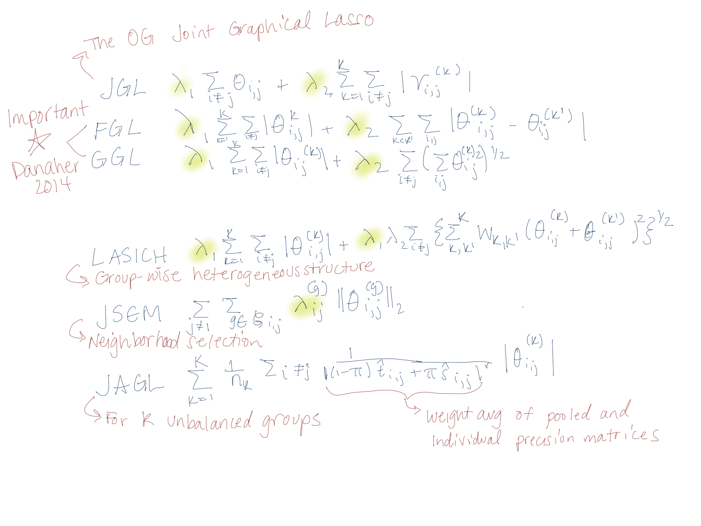
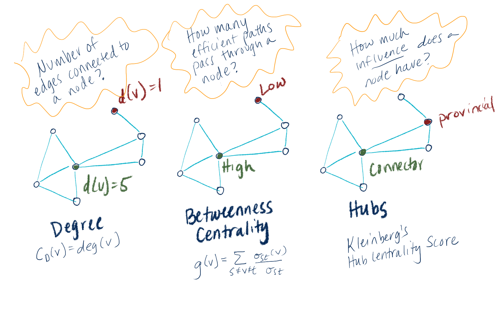

class: inverse, center, middle
# Statistical Landscape of DiNA methods
---

# Timeline 

- I found 40+ methods papers on DiNA methods published in the last 10 years

- The wide variety is due to addressing many subtly different problems

```{r out.width = '100%', echo = FALSE}
knitr::include_graphics("alg_timeline.png")
```

???
- In 2011, Guo et al. published the work “Joint estimation of multiple graphs” `r Cite(bib, "guo_joint_2011")`, which was followed by several new methods to estimate and test differences in biological networks `r Cite(bib, "cai_constrained_2011")` `r Cite(bib, "mohan_structured_2012")` `r Cite(bib, "jacob_more_2012")`

- Danaher et al. introduced group graphical lasso (GGL) and fused graphical lasso (FGL) in 2014 `r Cite(bib, "danaher_joint_2014")`, which was closely followed by other groups proposing direct estimation of the differences between graphs `r Cite(bib, "zhao_direct_2014")`, efficient structural estimation of multiple graphs `r Cite(bib, "zhu_structural_2014")`, and node-based learning of differential graphs `r Cite(bib, "mohan_node-based_2014")`

- Peterson, Stingo, and Vanucci introduced Bayesian inference for multiple graphical models in 2015 `r Cite(bib, "peterson_bayesian_2015")`. Subsequent Bayesian methods developed priors that account for the high dimensionality and sparsity common in biological data  `r Cite(bib, "tan_bayesian_2017")` `r Cite(bib, "richard_li_bayesian_2019")` `r Cite(bib, "sekula_single-cell_2021")`


---
# Why so many methods?

To address various data and modeling situations!
--
.pull-left[
What's your data like?
```{r out.width = '70%', echo = FALSE}
knitr::include_graphics("proscons.png")
```
]

.pull-right[
Other model considerations...
```{r out.width = '70%',echo = FALSE}
knitr::include_graphics("specifications.png")
```
]

---
# DiNA Methods Summary

.small[
- Gaussian: 
  - Graphical Lasso: JGL (Guo 2011)
      - Additional penalties for encouraging similar sparsity across groups: FGL & GGL (Danaher 2014)
            - Incorporating structural information: JSEM (Ma 2016)
                - Extension which doesn't require post-processing: jewel (Angelini 2021)
            - Doesn't require sparse inputs: DTrace (Yuan 2017)
                - Extension for multi-modal data: pDNA (Zhang 2017)
      - Node-based learning framework: PNJGL (Mohan 2014)
      - Unbalanced groups: JAGL (Shan 2018)
      - Hierarchical structure: JWLGL (Shan 2020)
  - Graphical Ridge: TFRE (Bilgrau 2020)
  - Adjust for global conditional dependencies to identify "driver" group-specific components: Dingo (Ha 2015)
  - Group-wise heterogeneous structure: LASICH (Saegusa 2016)
  - Direct estimation of difference: Zhao 2014
  - Uses latent nodes: Na 2019
  - Simulataneous clustering & GM estimation: SCAN (Hao 2017), Price 2021
]

---
# DiNA Methods Summay (cont'd)
.small[
- Non-Gaussian: SPIEC-EASY (Kurtz 2015), pDNA (Zhang 2017)
- Semi-parametric: Xu 2016
- Comparison across 3+ groups: BioNetStat (Jardim 2019)
- Group-wise structure: JMMLE (Majumdar 2022)
- High dimensional: JointGES (Wang 2020), FUDGE (Zhao 2022)
- Bayesian: Peterson 2015, Mitra 2016, Tan 2017, Li 2019, Sekula 2022
]

???
    - Is data Gaussian vs non Gaussian?
    - High dimensional vs low dimensional?
    - Do you want to use Frequentist vs Bayesian framework?
    - Is there local common structure or group-wise heterogeneous structure?
    - Do you need to estimate on 3+ groups? 
    - Are precision matrices sparse or not?

- You can further narrow down specific methods based on if you care about:

    - Hierarchical structure
    - Additional penalties or weighted penalties for unbalanced groups
    - Possibility to cluster and estimate GMs simultaneously
    - Computational efficiency
    - Incorporating known network structure or latent variables

---
# Graphical Lasso (gLasso)

* Because majority of available methods are some variation on gLasso, I'm going to go into the details of the optimization problem and penalty terms here. 

* Convex optimization problem for graphical lasso, where $\lambda$ is a tuning parameter and $||\Theta||_1$ is the sum of absolute values of the elements of $\Theta$. The solution gives an estimate for $\Sigma^{-1}$, the precision matrix:

$$maximize_\Theta\{logdet\Theta - tr(S\Theta) - \lambda||\Theta||_1\}$$
* *Graphical lasso* can be used even when $p >> n$, and when $\lambda$ is large then it forces the estimated precision matrix to be sparse (so few edges!).

* Joint graphical lasso builds upon this by estimating *multiple, related GGMs* from data with observations belonging to distinct classes (for example, cancer vs normal tissue). 

* The idea is to leverage information across the classes while still letting there be class-specific edges. Sparsity and similarity between graphs modified by penalty functions. 

---
# Notation

* $K$ number of classes 2+.  Index classes using $k$ = 1, ... $K$. 
* $\Sigma^{-1}_k$: True precision matrix for the kth class 
* $Y^{(k)}$: $n_k$ x $p$ matrix consisting of $n_k$ observations from the $k$th class on a set of $p$ features which are common to all $K$ datasets  
* $S^{(k)}$: Empirical covariance matrix for $Y^{(k)}$  
* $\Theta^{(k)}$: argument to convex optimization problem used for estimating $\Sigma^{-1}_k$  
* Index matrix arguments by using $i$ = 1, ..., $p$ and $j$ = 1, ..., $p$  
* $\lambda_1$ and $\lambda_2$: non-negative tuning parameters used in penalty function

---

# Major assumptions

* We assume the observations **within** each class are iid. 
* Also assume $\mu_k$, the mean for each class, is 0. i.e:   

$$Y^{(k)}_1, ..., Y^{(k)}_{nk} \sim N(0, \Sigma_k)$$

---
# Optimization problem for Joint Graphical Lasso

* Our goal is to estimate $\Sigma^{-1}_1$, ..., $\Sigma^{-1}_K$ by using penalized log-likelihood approach. 

* Again, we want each class to have it's own precision matrix, but to be able to use information across the classes to make them. 

* Seek $\hat{\Theta}$ by solving:

$$maximize_{\{\Theta\}}\left(\sum^{K}_{k=1}n_k[log\{det(\Theta^{(k)})\}-tr(S^{(k)}\Theta^{(k)}) - P(\{\Theta\})\right)$$

* A **major innovation of the Danaher 2014 paper**, is the generalization of the optimization problem to multiple classes, in addition to using the penalty function $P(\{\Theta\})$, for which the authors provide two different versions. 

---

# Penalty functions

* The general form for the penalty function is:

$$P(\{\Theta\}) = \lambda_1\sum^K_{k=1}\sum_{i \neq j}|\theta^{(k)}_{ij}| + \widetilde{P}\{\Theta\}$$

* Notice that the $P(\{\Theta\})$ is **not class specific**. It takes information from all the classes!

* The form of this penalty function will encourage the solutions to share certain characteristics such as locations of sparsity or value. 

* Depending on the form we choose and the value of the tuning parameters, we could essentially force joint graphical lasso to just perform unrelated graphical lasso on each of the $K$ classes (i.e. if $\widetilde{P}\{\Theta\}$ is zero.)

* Let's look at the possible forms for $\widetilde{P}\{\Theta\}$!

---

# Fused Graphical Lasso

* Fused Graphical Lasso (FGL) uses the following penalty function:

$$P(\{\Theta\}) = \lambda_1\sum^K_{k=1}\sum_{i \neq j}|\theta^{(k)}_{ij}| + \lambda_2\sum_{k<k'}\sum_{i,j}|\theta^{(k)}_{ij}-\theta^{(k')}_{ij}|$$

* When $\lambda_1$ is **large**, FGL makes sparse estimates of $\hat{\Theta}^{(1)}, ... , \hat{\Theta}^{(K)}$ 
* When $\lambda_2$ is **large**, many elements of $\hat{\Theta}^{(1)}, ... , \hat{\Theta}^{(K)}$ will be the same across classes  
* So, FGL "borrows information aggressively across classes, encouraging similar network structure and similar edge values"

---

# Group Graphical Lasso

* Group Graphical Lasso (GGL) uses the following penalty function:

$$P(\{\Theta\}) = \lambda_1\sum^K_{k=1}\sum_{i \neq j}|\theta^{(k)}_{ij}| + \lambda_2\sum_{i \neq j}\left(\sum_{i,j}{\theta^{(k)}_{ij}}^2\right)^{1/2}$$

* Lasso penalty applied to elements of the precision matrices  
* Group lasso penalty is applied to the (i, j) element across all K precision matrices
* When $\lambda_1$ is **large**, GGL makes sparse estimates of $\hat{\Theta}^{(1)}, ... , \hat{\Theta}^{(K)}$ 
* So, GGL just encourages a shared pattern of *sparsity*, not shared *edge values* (unlike FGL which encourage sharing across both)

---
# Other penalty functions

- Here is a selection of penalty functions for comparison. For full treatment see Tsai or Shojaie review papers. 

```{r out.width = '70%', echo = FALSE}

```


---
class: inverse, center, middle
```{r out.width = '80%',echo = FALSE}
knitr::include_graphics("quantifydif.png")
```

---
# Some Node Importance Measures

```{r out.width = '80%',echo = FALSE}

```

---
class: inverse, center, middle

# And finally... test the difference

---

# Methods & Software for testing

  - Lichtblau 2017 Compares 10 methods for quantiyfing node-specific differences between groups
  - Identify pairs of nodes with difference (Ha DINGO 2015, McKenzie DGCA 2016)
  - Identify subsets (3+) nodes that whose connections are different between groups (Jardim BioNetStat 2019, Arbet PND 2021)

- Various p-value options, e.g. permutation  

- Adjust for multiple testing!! Bonferoni for conservative estimate, FDR for less stringent. 


