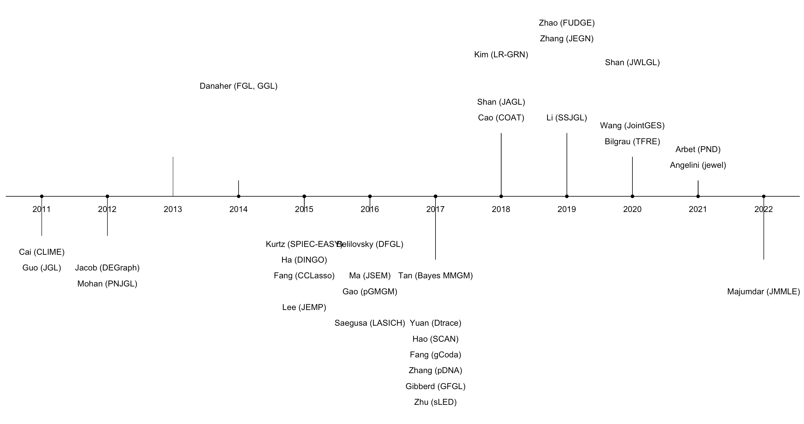
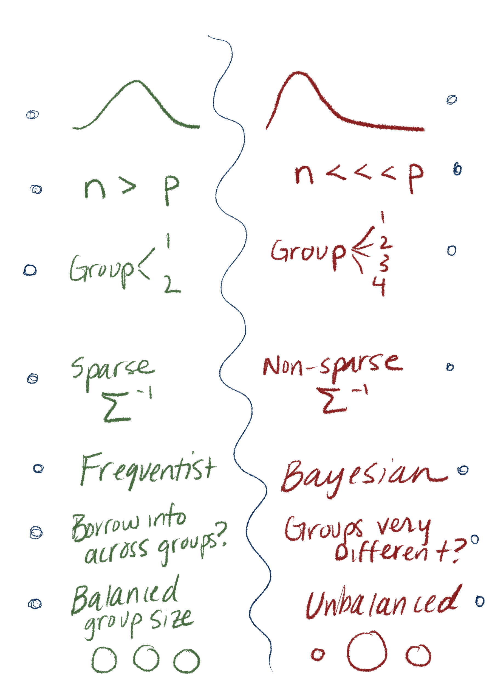
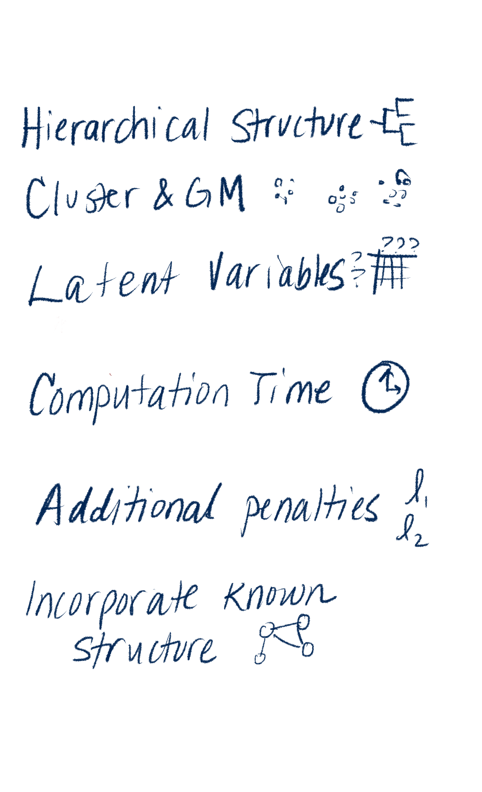
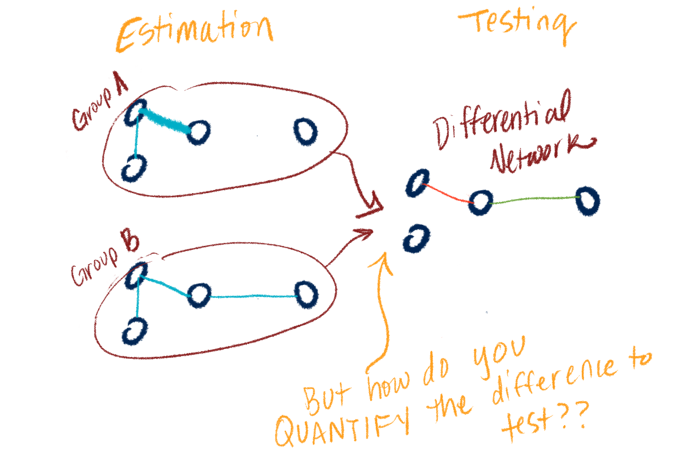
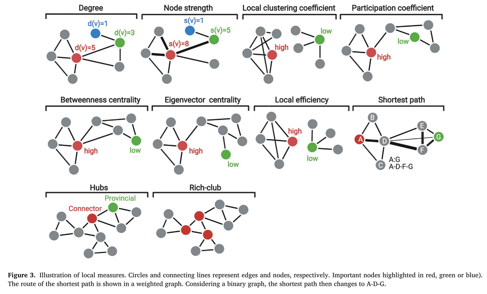
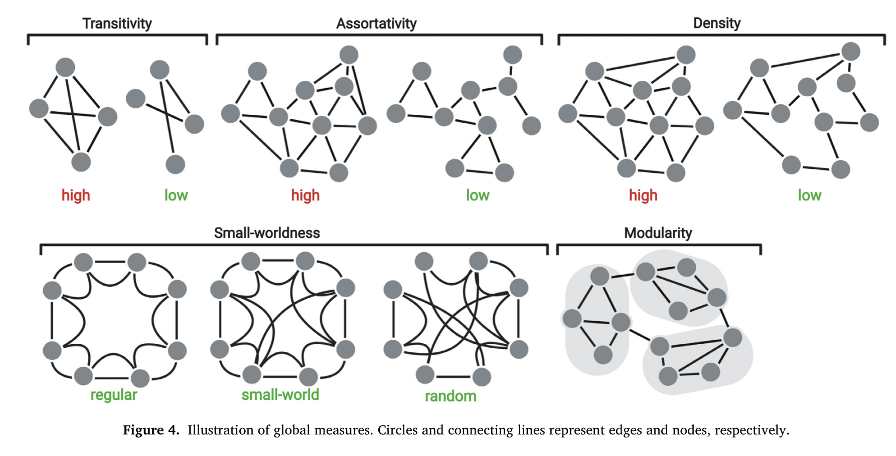

class: inverse, center, middle
# Statistical Landscape of DiNA methods


---
# Timeline 

- I found 40+ methods papers on DiNA methods published in the last 10 years

- The wide variety is due to addressing many subtly different problems

```{r out.width = '100%', echo = FALSE}

```

???
- In 2011, Guo et al. published the work “Joint estimation of multiple graphs” `r Cite(bib, "guo_joint_2011")`, which was followed by several new methods to estimate and test differences in biological networks `r Cite(bib, "cai_constrained_2011")` `r Cite(bib, "mohan_structured_2012")` `r Cite(bib, "jacob_more_2012")`

- Danaher et al. introduced group graphical lasso (GGL) and fused graphical lasso (FGL) in 2014 `r Cite(bib, "danaher_joint_2014")`, which was closely followed by other groups proposing direct estimation of the differences between graphs `r Cite(bib, "zhao_direct_2014")`, efficient structural estimation of multiple graphs `r Cite(bib, "zhu_structural_2014")`, and node-based learning of differential graphs `r Cite(bib, "mohan_node-based_2014")`

- Peterson, Stingo, and Vanucci introduced Bayesian inference for multiple graphical models in 2015 `r Cite(bib, "peterson_bayesian_2015")`. Subsequent Bayesian methods developed priors that account for the high dimensionality and sparsity common in biological data  `r Cite(bib, "tan_bayesian_2017")` `r Cite(bib, "richard_li_bayesian_2019")` `r Cite(bib, "sekula_single-cell_2021")`


---
# Why so many methods?

To address various data and modeling situations!
--
.pull-left[
What's your data like?
```{r out.width = '80%', echo = FALSE}

```
]

--
.pull-right[
Other model considerations...
```{r out.width = '80%',echo = FALSE}

```
]

???
    - Is data Gaussian vs non Gaussian?
    - High dimensional vs low dimensional?
    - Do you want to use Frequentist vs Bayesian framework?
    - Is there local common structure or group-wise heterogeneous structure?
    - Do you need to estimate on 3+ groups? 
    - Are precision matrices sparse or not?

- You can further narrow down specific methods based on if you care about:

    - Hierarchical structure
    - Additional penalties or weighted penalties for unbalanced groups
    - Possibility to cluster and estimate GMs simultaneously
    - Computational efficiency
    - Incorporating known network structure or latent variables

---
class: inverse, center, middle
```{r out.width = '80%',echo = FALSE}

```
---

# Quantifying "difference": Local Structure

```{r out.width = '90%',echo = FALSE}

```

---

# Quantifying "difference": Global Structure

```{r out.width = '90%',echo = FALSE}

```

---
class: inverse, center, middle

# And finally... test the difference

---

#For evaluating local difference: 

- Can do things like test each node for local structure difference (i.e. test each metabolite for "Degree" or "Node Strength" or "Betweenness Centrality")  

- Various p-value options, e.g. permutation  

- Adjust for multiple testing!! Bonferoni for conservative estimate, FDR for less stringent. 

---

# For evaluating global difference:

- Can do visualization (`iGraph`) and describe global structural differences (e.g. Density, modularity)

- Can perform global hypothesis test H0: $\Sigma_1 = \Sigma_2$ vs H1: $\Sigma_1 \neq \Sigma_2$

- For low-dimensional data this is simpler (e.g. `covTestR` package)

- For high-dimensional data use method proposed by Li & Chen 2012
    

