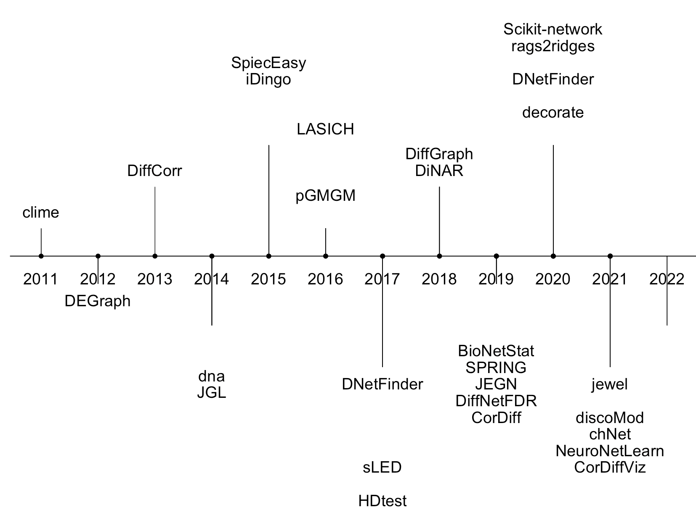

class: inverse, center, middle
# Software Landscape of DiNA methods


---
# Overview DiNA software landscape

- I found 26 different R packages and 2 Python packages that implement a variety of subtly different DiNA algorithms/pipelines


```{r out.width = '60%', echo = FALSE}



```

---
# Notes on software

- `JGL`, `iDingo`, `rags2ridges`, and `SpiecEasy` seem to be most popular and cited.

- I have a full tutorial for `JGL` posted on my [GitHub](https://mljaniczek.github.io/jgl-tutorial/), and Kate has one available for `iDingo`. 

- Currently working making tutorials for for `rags2ridges`, `Spiec-Easy` and will work through the other available methods


---
# JGL

- JGL package runs Fused Graphical Lasso (FGL) and Group Graphical Lasso from Danaher et al 2014

- Estimates sparse covariance matrices that are *similar* across classes

- Has a lot of useful functions to analyze the networks after estimating them, for example extracting hubs, edges, degree etc. 

- Graphical lasso uses L1 penalty, which encourages sparsity and as a result selects edges in the graph in the process of estimating precision matrix

- (If time allows we can open up my [JGL tutorial](https://mljaniczek.github.io/jgl-tutorial/) for a practical metabolomics example)

---