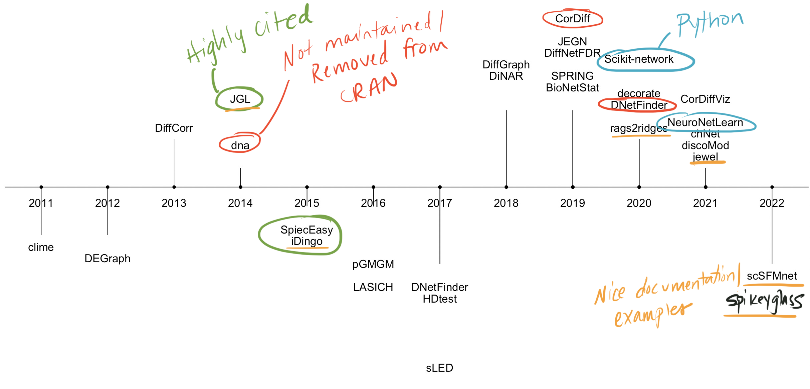

class: inverse, center, middle
# Software Landscape of DiNA methods


---
# Overview DiNA software landscape

- I found 26 different R packages and 2 Python packages that implement a variety of subtly different DiNA algorithms/pipelines


```{r out.width = '80%', echo = FALSE}



```

---
# Notes on software

- `JGL`, `iDingo`, `rags2ridges`, and `SpiecEasy` seem to be most popular and cited.

- I have a full tutorial for `JGL` posted on my [GitHub](https://mljaniczek.github.io/jgl-tutorial/), and Kate has one available for `iDingo`. 

- Currently working making tutorials for for `rags2ridges`, `Spiec-Easy` and will work through the other available methods

- For implementation in Python, see my repository: https://github.com/mljaniczek/diff_net_python which contains scripts on running sparse inverse covariance estimation methods in Python (Graphical Lasso and Ledoit-Wolf shrinkage methods).

- Bayesian methods: 
  - I am working on the [`spikeyglass`](https://mljaniczek.github.io/spikeyglass/) package which implements Li's 2019 method for Bayesian Joint Spike-and-Slab Graphical Lasso. 
  - The [`scSFMnet`](https://github.com/mnsekula/scSFMnet) package is also available for Sekula 2022 method for hierarchical Bayesian factor model, which can be used on zero-inflated count data. I found it easy to use so far!


---
# `JGL` package

.pull-left[
- `JGL` package runs Fused Graphical Lasso (FGL) and Group Graphical Lasso  (GGL) from Danaher et al 2014

- Estimates sparse covariance matrices that are *similar* across classes

- Has a lot of useful functions to analyze the networks after estimating them, for example extracting hubs, edges, degree etc. 

- Output plays nicely with `igraph` package for visualizations

- (If time allows we can open up my [JGL tutorial](https://mljaniczek.github.io/jgl-tutorial/) for a practical metabolomics example) ]

.pull-right[
```{r out.width = '100%', echo = FALSE}

```
]

---

# `spikeyglass` package

.pull-left[
* Implements Bayesian joint spike-and-slab graphical lasso methods, with input and output similar to `JGL` package

* Scripts were available from the 2019 SSJGL paper, but were difficult to work with so I made a package with the lead author! 

* See my [SSJGL tutorial](https://mljaniczek.github.io/ssjgl-tutorial/) for a practical metabolomics example that mirrors the JGL tutorial. (Image on right)
]

.pull-right[
```{r out.width = '100%', echo = FALSE}
knitr::include_graphics("dssggl-net.png")
```
]

---
# Comments: comparing SSJGL with JGL results

- Computation time: While SSJGL can take some time to run depending on your data size and parameters, I found it to be much faster than having to do cross-validation to tune the penalty terms using JGL. 

- I also found the final result of SSJGL to be much more sparse compared to JGL. (For example in metabolite dataset in linked tutorials, using DSS-GGL to jointly estimate the graph structure, Class 1 had 104 edges. This contrasts to the final CV-tuned GGL graph, which had 240 edges.)

- I also found the results of SSJGL to be stable no matter what starting parameters I threw at it, with the number of the edges in the solution ranging from 102-148 edges. This contrasts to when I threw all kinds of lambdas into JGL and the solution for this same dataset ranged from 44 edges (with large penalty parameter lambdas) to 692 edges (with small lambdas).

---

# SSJGL vs JGL: sensitivity to parameter choice

* For full SSJGL "stress test" results see [here](https://mljaniczek.github.io/ssjgl-tutorial/#4_Effect_of_parameters). Below DSS-GGL solution has 138 edges, not far from the above results.

* For full JGL "stress test" results see [here](https://mljaniczek.github.io/jgl-tutorial/#333_What_do_those_lambdas_do_anyways). Below GGL solution has 692 edges with small penalty parameters.

.pull-left[
```{r out.width = '40%', echo = FALSE}

```
]

.pull-right[
```{r out.width = '50%', echo = FALSE}

```
]

---

