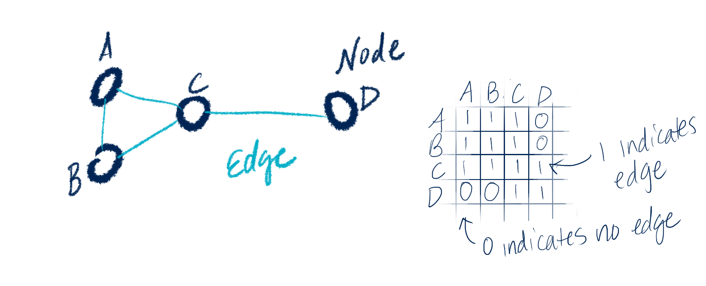
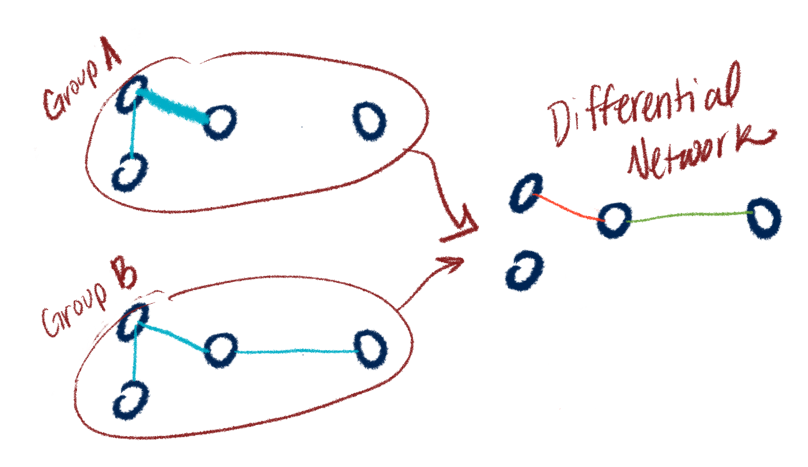

class: inverse, left, middle


# Landscape of Differential Network Analysis Methods & Software


#### Margaret Janiczek, MS

PhD Student, Biostatistics

```{r out.width = '25%', echo = FALSE}
knitr::include_graphics("UMasslong.png")
```


```{r setup, include=FALSE}
options(htmltools.dir.version = FALSE)
knitr::opts_chunk$set(echo = TRUE, eval = TRUE)
library(tidyverse)
library(gtsummary)
set.seed(1219)

```

```{r xaringan-themer, include=FALSE, warning=FALSE}
library(xaringanthemer)
style_mono_accent(
  base_color = "#881C1C"
)
```

```{r load_refs, include=FALSE, message = FALSE}
library(RefManageR)
BibOptions(check.entries = FALSE,
           bib.style = "authoryear",
           cite.style = "alphabetic",
           style = "markdown",
           hyperlink = TRUE,
           dashed = FALSE)
bib <- ReadBib("./proposal.bib", check = FALSE)
```


```{r echo = FALSE }

# setwd(here::here())
# Sys.setenv(TEXINPUTS=getwd(),
#            BIBINPUTS=getwd(),
#            BSTINPUTS=getwd())
```


---

# Presentation Overview

- Background on graphical models and differential networks

- Overview of statistical landscape for differential network analysis

- Overview of available software

- Links to practical application using a few software options

- Discussion & feedback!

???
- My goal is to give you an overview of the statistical and software landscape, as well as a few applied examples. 

- I'm working on a writing a full tutorial geared toward helping applied researchers implement these methods - I look forward to your feedback! 

# Motivation

- Identifying networks in biomedical data, and how they differ across populations, can help find drivers of disease and targets for treatment

```{r out.width = '75%', echo = FALSE}
knitr::include_graphics("difnet_overview.png")
```

- Certain biomedical research questions lend themselves well to network/pathway analysis

    - Data from brain scans (Alzheimer's patient scans over time)
    - Gene expression (cancer vs normal tissue)
    - Microbiome (Crohn's disease vs Healthy Control)
    - Metabolomics - any applications from the group here?
    

---

# Background: Graphical Model

- Graphical models express connections between variables. When undirected, the connection doesn't imply any directionality.

```{r out.width = '70%', echo = FALSE}
#


```


- Connected edges can be seen in an **Adjacency Matrix**, where anything with a zero is considered "conditionally independent", and anything with a 1 is considered "conditionally dependent"

- In this example, A and B are **conditionally independent** of D


---

# Gaussian Graphical Model

- Gaussian Graphical Models (GGMs) are the most widely used probabilistic graphical models (See Kate Shutta's recently published tutorial on GGMs for full details! `r Cite(bib, "shutta_balasubramanian_tutorial")`)

- Assume data $\mathbf{y}$ is distributed as multivariate Gaussian $N(\mu, \Sigma)$ with mean vector $\mathbf{\mu}$ and precision matrix $\Sigma^{-1} = \Omega$ whose entries correspond to partial correlation between variables

- So any two entries are conditionally independent if entry in $\Omega$ is zero. 

- In low dimensional setting, the Likelihood function:

  $$l(\Omega; S) = ln|\Omega| - tr(S\Omega)$$

- Where $\Omega = \Sigma^{-1}$ is the "precision matrix" and $S$ is sample covariance matrix. 

- We want an estimate for this which we will call $P = S^{-1}$. This will give us the graph structure.

---

# More than one graphical model

- Say you have data from two groups, like disease and healthy control.

- Say you estimate a graphical model for each group, then want to compare the resulting networks.


```{r out.width = '50%', echo = FALSE}
#


```

---

# But are the networks different??

- How do you estimate them?

- How do you test the difference? 

- How do you even *characterize* the difference? (edges? nodes? hubs? general structure?)

- This all falls under DIFFERENTIAL NETWORK ANALYSIS! (DiNA)

```{r out.width = '50%', echo = FALSE}
#


```

---
```{r child='02_stats_overview.Rmd'}
```
---

```{r child='03_software.Rmd'}
```
--- 
# Takeaways

- DiNA has potential to be a useful tool in biomedical research 

- There are many ways to customize the estimation and testing process to fit research question and data types

- However the broad landscape of methods and software and the current lack of practical applied tutorials comparing software methods seems like a barrier to widespread use

- I'm working on trying to bridge the gap between statistical methodology and applied researchers! Full tutorial forthcoming! 

---
# Questions & Comments?

- What would you find useful in an applied tutorial? 

- Any methods you use/come across that I haven't mentioned? 

- Other questions/comments?

---
# Thank you!

- Dr. Raji Balasubramanian for mentorship and the metabolomics data, which was previously presented at ENAR 2021 with Dr. Denise Scholtens. 

- Members of [Balasubramanian Lab](https://raji-lab.github.io/) for helpful feedback on this research and presentation

- Thank you to Dr. Kate Hoff Shutta and Dr. Yukun Li who provided code for the beautiful circular network graphs. (And Kate for inviting me to present here!)

- Dr. Zehang Richard Li for providing SSJGL scripts and encouragement for R package creation!  


.small[.footnote[Github: @mljaniczek <br> Website: mljaniczek.github.io/]]

---

# R tools used in analysis

* [spikeyglass](https://mljaniczek.github.io/spikeyglass/) for running SSJGL
* [igraph](https://igraph.org/): for plotting network graphs  
* [JGL](https://cran.r-project.org/package=JGL): for running JGL 
* [tidyverse](https://www.tidyverse.org/): for data wrangling   
* [RColorBrewer](https://cran.r-project.org/package=RColorBrewer): for pretty color palettes
* pheatmap: My favorite heatmap package, makes the heatmaps with annotated tracks
(See this [blog post](https://davetang.org/muse/2018/05/15/making-a-heatmap-in-r-with-the-pheatmap-package/) by Dave Tang for a nice tutorial on using this package.)
* Slides created via the R package [**xaringan**](https://github.com/yihui/xaringan).

---
# References

```{r, results='asis', echo=FALSE, warning=FALSE}
PrintBibliography(bib)
```

