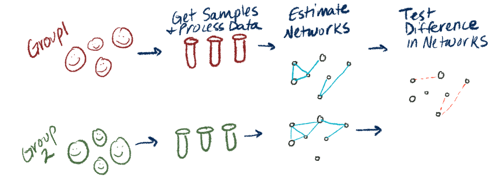
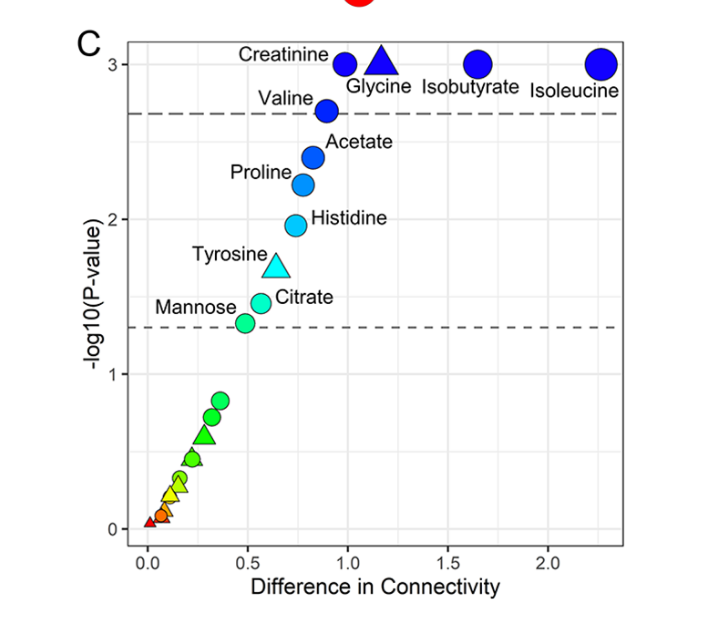

```{r setup, include=FALSE}
options(htmltools.dir.version = FALSE)
knitr::opts_chunk$set(echo = TRUE, eval = TRUE)
library(tidyverse)
library(gtsummary)
set.seed(1219)

```

```{r xaringan-themer, include=FALSE, warning=FALSE}
library(xaringanthemer)
style_mono_accent(
  base_color = "#881C1C"
)
```

```{r load_refs, include=FALSE, message = FALSE}
library(RefManageR)
BibOptions(check.entries = FALSE,
           bib.style = "authoryear",
           cite.style = "alphabetic",
           style = "markdown",
           hyperlink = TRUE,
           dashed = FALSE)
bib <- ReadBib("./proposal.bib", check = FALSE)
```

class: inverse, left, middle


# But are the networks different? 

### Using Differential Network Analysis Software with Metabolite Data

#### COMETS Early Career Investigator Group Meeting: October 11, 2022


#### Margaret Janiczek

PhD Student, Biostatistics

```{r out.width = '25%', echo = FALSE}
knitr::include_graphics("UMasslong.png")
```


---

```{r echo = FALSE }

# setwd(here::here())
# Sys.setenv(TEXINPUTS=getwd(),
#            BIBINPUTS=getwd(),
#            BSTINPUTS=getwd())
```

# Motivation

- Identifying networks in biomedical data, and how they differ across populations, can help find drivers of disease and targets for treatment

```{r out.width = '75%', echo = FALSE}

```

- Certain biomedical research questions lend themselves well to network/pathway analysis

    - Data from brain scans (Alzheimer's patient scans over time)
    - Gene expression (cancer vs normal tissue)
    - Microbiome (Crohn's disease vs Healthy Control)
    - Metabolomics - any applications from the group here?
    
---
# Motivation

.pull-left[
```{r out.width = '75%', echo = FALSE}

```
]

.pull-left[
```{r out.width = '75%', echo = FALSE}

```

.small[- From study using DiNA to reveal metabolic determinants associated with mortality in acute myocardial infarction patients (Vignoli et al 2020)

- A: metabolite network from survivors. B: Metabolite Network from Deceased. C: Difference in connectivity vs p-value (Bonferroni adjusted)]
]


---

# Presentation Overview

- Background on graphical models and differential networks

- Overview of statistical landscape for differential network analysis

- Overview of available software

- Brief practical application using a few software options

- Discussion & feedback!

???
- My goal is to give you an overview of the statistical and software landscape, as well as a few applied examples. 

- I'm working on a writing a full tutorial geared toward helping applied researchers implement these methods - I look forward to your feedback! 

---

# Background: Undirected Graphical Model

- Graphical models express connections between variables. When undirected, the connection doesn't imply any directionality.

```{r out.width = '75%', echo = FALSE}
#


```


- Connected edges can be seen in a **Precision Matrix**, where anything with a zero is considered "conditionally independent"

- In this example, A and B are **conditionally independent** of D

---

# Background: Gaussian Graphical Model

- If we can assume the data are normally distributed, the **Precision Matrix** can be estimated using the inverse of the correlation matrix!

- High dimensional data can be handled by adding shrinkage penalties which will force values down to zero. 

- There are many other estimation details I won't go into here. 

- See Kate Shutta's recently published tutorial on Gaussian Graphical Models for details! `r Cite(bib, "shutta_balasubramanian_tutorial")`


---

# More than one graphical model

- Say you have data from two groups, like disease and healthy control.

- Say you estimate a graphical model for each group, then want to compare the resulting networks.


```{r out.width = '50%', echo = FALSE}
#


```

---

# But are the networks different??

- How do you estimate them?

- How do you test the difference? 

- How do you even *characterize* the difference? (edges? nodes? hubs? general structure?)

- This all falls under DIFFERENTIAL NETWORK ANALYSIS! (DiNA)

```{r out.width = '50%', echo = FALSE}
#


```

---
```{r child='02_stats_overview.Rmd'}
```
---

```{r child='03_software.Rmd'}
```


--- 
# Takeaways

- DiNA has potential to be a useful tool in biomedical research 

- There are many ways to customize the estimation and testing process to fit research question and data types

- However the broad landscape of methods and software and the current lack of practical applied tutorials comparing software methods seems like a barrier to widespread use

- I'm working on trying to bridge the gap between statistical methodology and applied researchers! Full tutorial forthcoming! 

---
# Questions & Comments?

---
# Thank you!

- Dr. Raji Balasubramanian & [Balasubramanian Lab](https://raji-lab.github.io/)

- Dr. Kate Hoff Shutta


.small[.footnote[Github: @mljaniczek <br> Website: mljaniczek.github.io/ <br> Slides created via the R package [**xaringan**](https://github.com/yihui/xaringan).]]


---
# References

```{r, results='asis', echo=FALSE, warning=FALSE}
PrintBibliography(bib)
```


